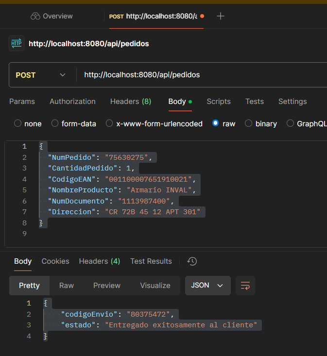
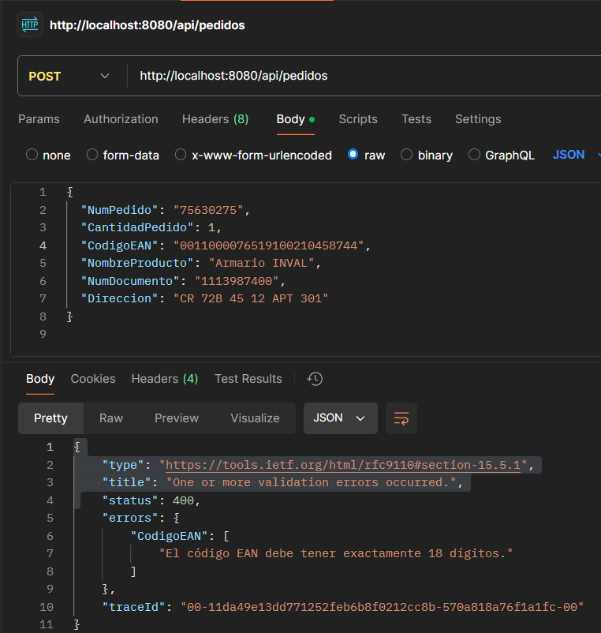
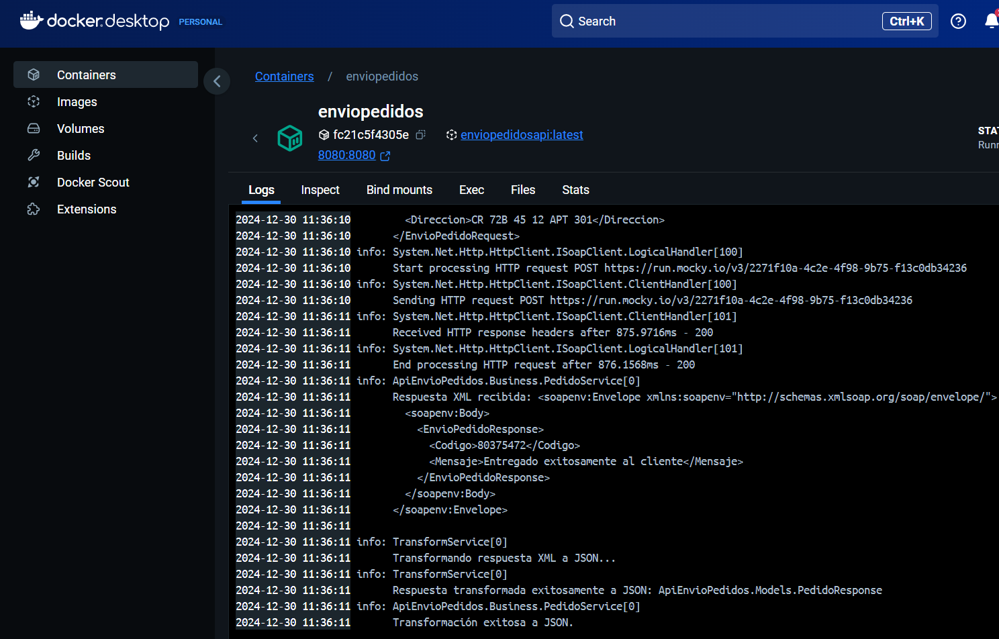

# API REST - Servicio de Abastecimiento ACME



## Descripción General
Este proyecto implementa una API REST en .NET 8 que recibe pedidos de la tienda de carrera 70 de ACME. La API transforma los mensajes JSON a XML (SOAP) y los envía a un endpoint externo. Posteriormente, convierte la respuesta SOAP a formato JSON y la retorna al cliente.

El objetivo principal es facilitar el flujo de pedidos automatizados, asegurando la interoperabilidad entre sistemas mediante la transformación de formatos de datos.

## Requisitos
- **Visual Studio Code**
- **.NET SDK 8.0.404 (x64)**
- **Docker**
- **Git**

## Instalación y Configuración
1. **Clonar el repositorio:**
   ```bash
   git clone https://github.com/JhonHeiler/api-envio-pedidos.git
   cd APIENVIOPEDIDOS
Restaurar dependencias:

bash
Copiar código
dotnet restore
Construir el proyecto:

bash
Copiar código
dotnet build
Ejecutar la API:

bash
Copiar código
dotnet run
Contenedor Docker
Para ejecutar el proyecto en Docker:

Construir la imagen Docker:

bash
Copiar código
docker build -t acme-api . 
Ejecutar el contenedor:

bash
Copiar código
docker run -d -p 8080:8080 --name enviopedidos enviopedidosapi
Acceder a la API:

bash
Copiar código
http://localhost:8080/api/pedidos
Endpoints
POST /api/pedidos
Descripción: Recibe pedidos en formato JSON y los transforma a XML (SOAP) para enviarlos a un sistema externo.

Ejemplo de Petición (JSON):

json
Copiar código
{
  "NumPedido": "75630275",
  "CantidadPedido": 1,
  "CodigoEAN": "001100007651910021",
  "NombreProducto": "Armario INVAL",
  "NumDocumento": "1113987400",
  "Direccion": "CR 72B 45 12 APT 301"
}
Respuesta Exitosa (JSON):

json
Copiar código
{
 "codigoEnvio": "80375472",
 "estado": "Entregado exitosamente al cliente"
}
Error de Validación (JSON):

json
Copiar código
{
    "type": "https://tools.ietf.org/html/rfc9110#section-15.5.1",
    "title": "One or more validation errors occurred.",
    "status": 400,
    "errors": {
        "CodigoEAN": [
            "El código EAN debe tener exactamente 18 dígitos."
        ]
    },
    "traceId": "00-8626aba8ebe632ff3bef9f037bf5cc36-1108a28c24f77bd8-00"
}
Mapeo de Datos
JSON a XML (SOAP)
REST (JSON)	SOAP (XML)	Ejemplo
numPedido	pedido	75630275
cantidadPedido	Cantidad	1
codigoEAN	EAN	00110000765191002104587
nombreProducto	Producto	Armario INVAL
numDocumento	Cedula	1113987400
direccion	Direccion	CR 72B 45 12 APT 301
XML (SOAP) a JSON
SOAP (XML)	REST (JSON)	Ejemplo
Codigo	codigoEnvio	80375472
Mensaje	estado	Entregado exitosamente al cliente
Ejemplo de Respuesta XML
xml
Copiar código
<soapenv:Envelope xmlns:soapenv="http://schemas.xmlsoap.org/soap/envelope/" xmlns:env="http://WSDLs/EnvioPedidos/EnvioPedidosAcme">
   <soapenv:Header/>
   <soapenv:Body>
      <env:EnvioPedidoAcmeResponse>
         <EnvioPedidoResponse>
            <Codigo>80375472</Codigo>
            <Mensaje>Entregado exitosamente al cliente</Mensaje>
         </EnvioPedidoResponse>
      </env:EnvioPedidoAcmeResponse>
   </soapenv:Body>
</soapenv:Envelope>
Manejo de Errores
Errores Comunes:
400 Bad Request: Datos de entrada no válidos o faltantes.
502 Bad Gateway: Error al llamar al servicio SOAP externo.
500 Internal Server Error: Error inesperado en la API.
Ejemplo de error 400 por validación del CodigoEAN:

json
Copiar código
{
    "type": "https://tools.ietf.org/html/rfc9110#section-15.5.1",
    "title": "One or more validation errors occurred.",
    "status": 400,
    "errors": {
        "CodigoEAN": [
            "El código EAN debe tener exactamente 18 dígitos."
        ]
    }
}
Estructura del Proyecto
Copiar código
ApiEnvioPedidos/
├── Controllers/
│   └── PedidosController.cs
├── Business/
│   └── PedidoService.cs
├── Services/
│   ├── SoapClient.cs
│   └── TransformService.cs
├── Models/
│   ├── PedidoRequest.cs
│   └── PedidoResponse.cs
├── Program.cs
├── Dockerfile
└── ApiEnvioPedidos.csproj
Autor
Jhon Heiler
GitHub: JhonHeiler